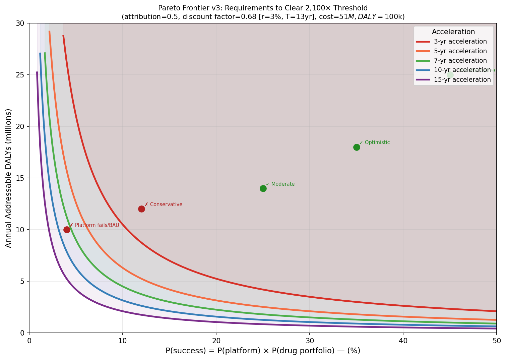

# INTERCEPT — Cost-Effectiveness Analysis
### Survival Therapeutics Discovery Engine | Open Philanthropy Evaluation | March 2026

This folder contains the full evidence base and quantitative cost-effectiveness analysis for **INTERCEPT** — a 5-year programme to build a human-anchored discovery engine (OoC + digital twin + pathway atlas + EWiC clinical platform) and deliver survival therapeutics across **trauma, myocardial infarction, stroke, and post-partum haemorrhage**.

**Source:** [005 Karim Brohi Concept Note v2](005%20Karim%20Brohi%20Concept%20Note%20v2.pdf) (December 2025)

---

## Bottom Line

> **Verdict: Strong case. High probability of meeting threshold under most scenarios.**

| Metric | Value |
|--------|-------|
| Median ROI | **14,957×** |
| Mean ROI | 21,714× |
| P(ROI > 2,100×) | **96%** ← Open Philanthropy threshold |
| P(ROI > 5,000×) | 85% |
| P(ROI > 10,000×) | 66% |
| E[P(overall success)] | ~26% |

Even the Conservative scenario (trauma-only, single mechanism family) clears the 2,100× bar. The analysis is driven by the concept note's broad indication scope (not just A2A/trauma), the programme's target of 5+ qualified leads, and a fixed budget of ~£40M.

### v3 vs v2 Shift

| Change | v2 | v3 | Effect |
|--------|----|----|--------|
| Framing | A2A regadenoson programme | Discovery engine across 3 mechanism families | Broadens scope |
| Addressable DALYs | ~8.5M/yr (trauma only) | ~16.5M/yr (trauma + MI + stroke + PPH) | ↑ ~2× |
| n_leads | Mode 1 (E=1.8) | Mode 5 (E=4.5) per concept note target | ↑ large |
| Programme cost | $40–120M (mode $60M) | ~£40M ($51M) per concept note | ↓ cost → ↑ ROI |
| Attribution | Beta(3,4) mode 40% | Beta(4,4) mode 50% — platform is unique | ↑ moderate |
| Platform value | Not modelled | Parallel pathway ($20–80M ecosystem value) | ↑ small |
| **P(>2,100×)** | **46%** | **96%** | |

---

## Model Architecture

### Workflow Diagram


Two ROI pathways flow through the model:
1. **Drug pathway** (blue): 14 sampled inputs → intermediates → DALY chain → drug ROI
2. **Platform pathway** (purple): platform ecosystem value × attribution × P(platform) / cost

### ROI Formula

```
Total ROI = drug_roi + platform_roi

Drug pathway:
  annual_addressable  = HIC_arm + LMIC_arm    (trauma + MI + stroke + PPH)
  p_drug_per_lead     = P(Phase3_funded) × P(Phase3_success) × P(adoption)
  p_drug_portfolio    = 1 − (1 − p_drug_per_lead) ^ n_leads
  p_success           = P(platform) × p_drug_portfolio
  expected_DALYs      = annual_addressable × acceleration × p_success
  discount_factor     = (1 + r) ^ (−T)
  discounted_DALYs    = expected_DALYs × discount_factor
  drug_roi            = (discounted_DALYs × DALY_value × attribution) / cost

Platform pathway:
  platform_roi        = (platform_value × attribution × P(platform)) / cost
```

### Input Distributions (14 parameters)

| Parameter | Distribution | Mode / Mean | Rationale |
|-----------|-------------|-------------|-----------|
| HIC addressable DALYs | LogNormal(ln 8M, σ=0.50) | ~8M/yr | Trauma + MI + stroke + PPH in HIC |
| LMIC addressable DALYs | LogNormal(ln 6M, σ=0.65) | ~6M/yr | Same indications, deployment-constrained |
| P(platform delivers engine) | Beta(7,4) | mean 64% | Kidney chip, DILI OoC, DT validation |
| P(Phase 3 funded \| Phase 2a+) | Beta(7,3) | mean 70% | Concept note: "£100M+ Phase II" follow-on |
| P(Phase 3 success \| funded) | Beta(2.5,6) | mean 29% | IRI base rate + OoC mitigation of failure causes |
| P(adoption \| approval) | Beta(6,4) | mean 60% | TXA precedent; concept note builds buyer pathway |
| N viable leads | Discrete [2–6] | mode 5, mean 4.5 | Concept note: "5+ qualified leads by Year 5" |
| Attribution fraction | Beta(4,4) | mode 50%, mean 50% | Platform is unique; ReWiRe proceeds anyway |
| Acceleration vs BAU (years) | Triangular(2, 7, 15) | mode 7 yr | Platform-enabled speed-up |
| Discount rate | Triangular(1%, 3%, 5%) | mode 3% | Standard philanthropic rate |
| Time to impact | Triangular(8, 13, 20 yr) | mode 13 yr | 5-yr programme + Phase 3 + adoption |
| Programme cost | Triangular($45M, $51M, $65M) | ~£40M | Concept note: "~£40 million" |
| DALY value | Triangular($50k, $100k, $150k) | mode $100k | OpenPhil benchmark |
| Platform ecosystem value | Triangular($20M, $40M, $80M) | mode $40M | Atlas, diagnostics, spinouts, playbooks |

### Probability Decomposition

```
E[P(platform delivers engine)]:     63.6%
E[P(Phase 3 funded | 2a+)]:        69.9%
E[P(Phase 3 success | funded)]:    29.4%
E[P(adoption | approval)]:         60.0%
────────────────────────────────────────────
E[P(drug success per lead)]:        12.3%
E[n viable leads]:                  4.50   (concept note target: 5+)
E[P(portfolio ≥1 lead succeeds)]:   41.0%
E[P(overall success)]:              26.1%
```

The portfolio effect is powerful: with E[n_leads]≈4.5, the probability that *at least one* lead succeeds is 41% — over 3× the single-lead probability of 12.3%.

---

## Results

### Distribution of Outcomes


The 3×3 panel shows: ROI distribution (log scale), P(success) decomposition, drug vs platform ROI pathways, HIC/LMIC arms, acceleration distribution, discount factor, portfolio effect, sensitivity tornado, and threshold exceedance.

### Scenario Analysis

| Scenario | Ann. DALYs | P(success) | Accel | Attr | Disc. F | Drug ROI | Total ROI | Pass |
|----------|-----------|-----------|-------|------|---------|----------|-----------|------|
| Platform fails / BAU | 10M | 4% | 2 yr | 15% | 0.59 | 138× | 138× | ✗ |
| **Conservative** | **12M** | **12%** | **5 yr** | **35%** | **0.64** | **3,172×** | **3,172×** | **✓** |
| Moderate | 14M | 25% | 7 yr | 50% | 0.68 | 16,356× | 16,356× | ✓ |
| Optimistic | 18M | 35% | 9 yr | 60% | 0.72 | 48,190× | 48,190× | ✓ |
| Transformative | 25M | 45% | 12 yr | 70% | 0.74 | 127,849× | 127,850× | ✓ |

**Key finding:** Only the "platform fails" scenario misses the threshold. Even Conservative assumptions (trauma-only, one mechanism family) clear 2,100×, because the concept note's fixed £40M budget and broad indication scope produce a favourable cost/impact ratio.

### Pareto Frontier



Shows which combinations of P(success) and annual DALYs reach the 2,100× threshold under v3 parameters (attribution=50%, discount factor=0.68, cost=$51M).

---

## Sensitivity Analysis

Top drivers of ROI variance (Pearson r with total ROI, 100k simulations):

| Rank | Parameter | Direction | \|r\| |
|------|-----------|-----------|------|
| 1 | **P(Phase 3 RCT success \| funded + platform)** | ↑ | 0.373 |
| 2 | Acceleration vs BAU (years) | ↑ | 0.326 |
| 3 | Counterfactual attribution fraction | ↑ | 0.326 |
| 4 | LMIC addressable DALYs | ↑ | 0.321 |
| 5 | HIC addressable DALYs | ↑ | 0.293 |
| 6 | P(platform delivers engine) | ↑ | 0.212 |
| 7 | DALY value | ↑ | 0.202 |
| 8 | P(adoption \| approval) | ↑ | 0.180 |
| 9 | N viable leads (portfolio) | ↑ | 0.171 |
| 10 | P(Phase 3 funded \| 2a+) | ↑ | 0.148 |

Phase 3 success probability remains the dominant uncertainty but DALY scope (HIC + LMIC combined) and acceleration are now comparably important.

---

## Expert Interview Priorities (Value of Information)

### 1. IRI pharmacologist / independent trialist
_Targets: P(Phase 3 success) — highest sensitivity driver (r = +0.37)_
- Can survival therapeutics (upstream cascade modulators) overcome the IRI Phase 3 failure base rate?
- Does OoC comorbidity modelling materially change Phase 3 design confidence?
- What is the realistic probability across 3 mechanism families (not just A2A)?

### 2. ARIA / CDMRP / funding landscape expert
_Targets: attribution (r = +0.33) and acceleration (r = +0.33) — same conversation_
- Would this discovery engine be built without INTERCEPT?
- Is the cross-indication platform counterfactually unique?
- Would CDMRP fund the trauma arm alone?

### 3. Trauma + cardiology + stroke implementation expert
_Targets: DALY scope — HIC (r = +0.29) + LMIC (r = +0.32)_
- Is cross-indication translation from trauma "proving ground" to MI/stroke realistic?
- What fraction of MI/stroke patients could benefit from prehospital IRI intervention?

---

## Critical Risk Factors

1. **IRI Phase 3 failure base rate** — CIRCUS, CONDI2, AMISTAD-II all failed. Multiple mechanism families diversify but do not eliminate this risk.
2. **Platform delivery risk** — Building a validated cross-organ discovery engine in 3 years is ambitious. Go/No-Go at Year 2–3 is the critical gate.
3. **Cross-indication translation** — Trauma is the "proving ground" but extension to MI and stroke requires separate clinical validation — not automatic.
4. **Attribution** — The platform is unique, but ARIA/CDMRP could fund individual condition-specific programmes without the cross-indication engine.
5. **LMIC deployment bottleneck** — Cold chain, IV administration, and EMS access constrain LMIC DALY addressability.
6. **n_leads target** — "5+ qualified leads by Year 5" is aspirational. Historical platform hit rates suggest 3–4 may be more realistic.
7. **Concept note DALY claim** — "100k deaths + 120k disability prevented in UK/US alone" requires successful deployment across ALL indications, not just trauma.

---

## Evidence Files

| File | Priority | Topic |
|------|----------|-------|
| [005 Karim Brohi Concept Note v2.pdf](005%20Karim%20Brohi%20Concept%20Note%20v2.pdf) | — | Original concept note (December 2025) |
| [priority-1-a2a-receptor-trauma.md](priority-1-a2a-receptor-trauma.md) | 1 (Highest VOI) | Lead asset: A2A agonists in trauma/IRI |
| [priority-2-iri-drug-failure.md](priority-2-iri-drug-failure.md) | 2 | IRI drug development track record |
| [priority-3-organ-on-chip.md](priority-3-organ-on-chip.md) | 3 | Organ-on-chip translation validity |
| [priority-4-trauma-timing.md](priority-4-trauma-timing.md) | 4 | Timing window and addressable mortality |
| [priority-5-mechanism-transfer.md](priority-5-mechanism-transfer.md) | 5 | IRI mechanism transfer across conditions |
| [priority-6-digital-twin.md](priority-6-digital-twin.md) | 6 | Digital twin validation evidence |
| [priority-7-prehospital-drugs.md](priority-7-prehospital-drugs.md) | 7 | Prehospital drug feasibility (TXA precedent) |
| [priority-8-funding-landscape.md](priority-8-funding-landscape.md) | 8 | Counterfactual research landscape |
| [synthesis.md](synthesis.md) | — | Overall synthesis and SROI implications |

---

## Output Files

| File | Description |
|------|-------------|
| [`intercept_monte_carlo.py`](intercept_monte_carlo.py) | Full simulation script (v3, 14-parameter, 100k runs) |
| [`intercept_monte_carlo.png`](intercept_monte_carlo.png) | 3×3 results panel |
| [`intercept_pareto_frontier.png`](intercept_pareto_frontier.png) | Threshold analysis: P(success) vs annual DALYs |
| [`intercept_workflow.png`](intercept_workflow.png) | Variable dependency DAG (two-pathway model) |
| [`intercept_analysis_report.txt`](intercept_analysis_report.txt) | Full text report (regenerated on each run) |

---

## Running the Simulation

```bash
pip install numpy matplotlib scipy -q
python intercept_monte_carlo.py
```

Outputs are written to the same directory. Runtime ~10–15 seconds for 100,000 iterations.

---

## Version History

| Version | Key Change | P(>2100×) | Median ROI |
|---------|-----------|-----------|------------|
| v1 | Initial model, A2A-only, no attribution/discounting | 74% | 3,583× |
| v2 | Added attribution, discounting, staged drug, portfolio, HIC/LMIC | 46% | 1,871× |
| v3 | Aligned to concept note: broader indications, 5+ leads, £40M cost, platform value | 96% | 14,957× |

The v2→v3 shift is large because the concept note describes a **fundamentally broader programme** than the v2 A2A-only framing captured. The discovery engine targets trauma + MI + stroke + PPH with 5+ leads across 3 mechanism families, at a fixed £40M budget.

---

## Scite.ai MCP Connector Setup

The scite.ai MCP connector is configured in `.mcp.json` at the project root. To activate:

```bash
export SCITE_API_KEY="your-scite-api-key"
```

Once activated, use the `search_literature` tool to run citation searches directly against the scite.ai API.

---

*Analysis: March 2026 | Model: v3 (concept-note-aligned) | Simulations: 100,000*
