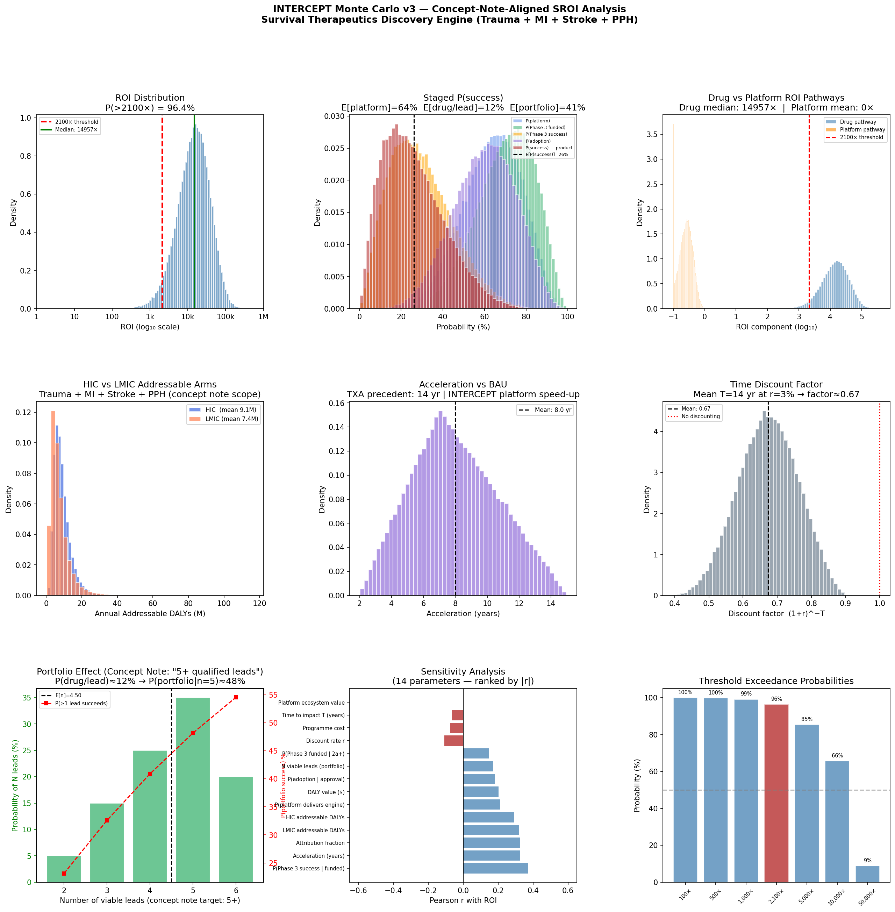
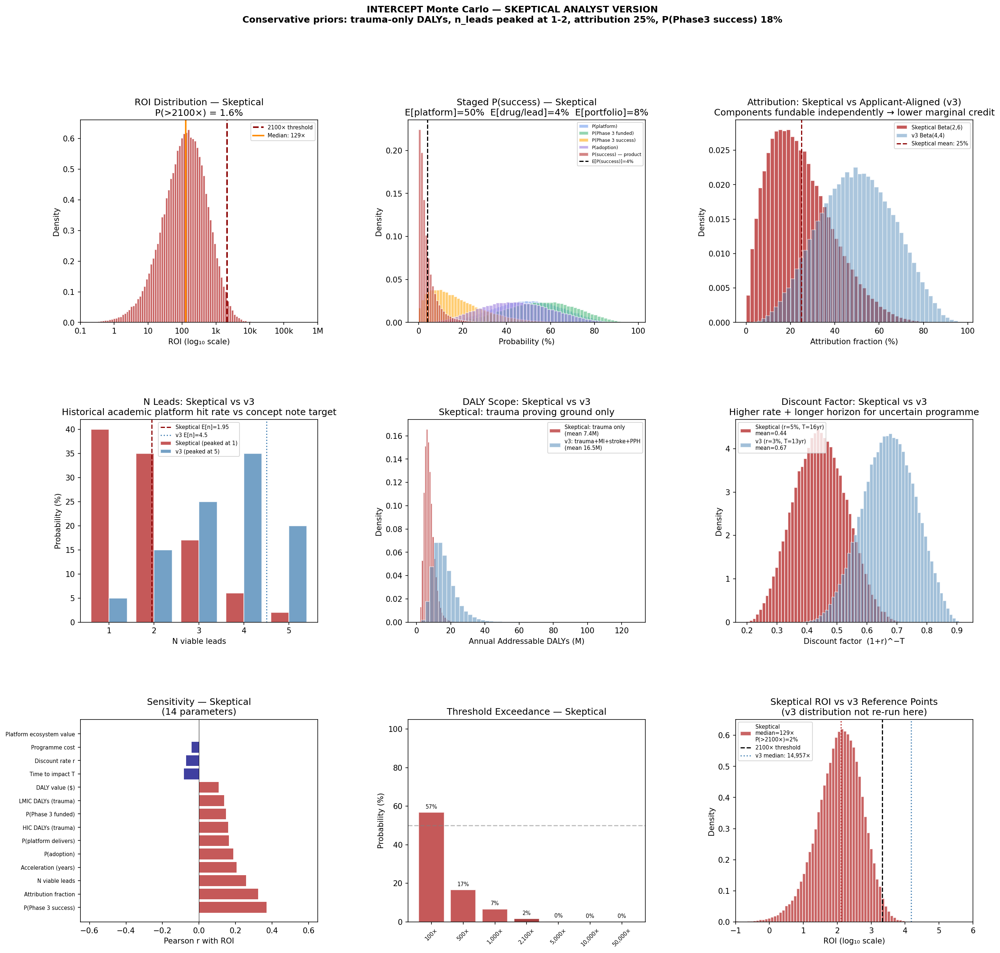
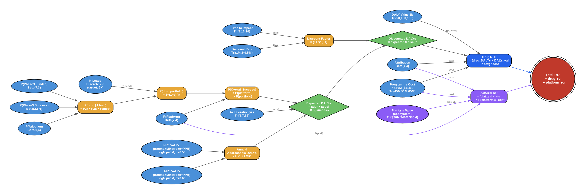

# INTERCEPT — Cost-Effectiveness Analysis
### Survival Therapeutics Discovery Engine | Open Philanthropy Evaluation | March 2026

This folder contains the full evidence base and quantitative cost-effectiveness analysis for **INTERCEPT** — a 5-year programme to build a human-anchored discovery engine (OoC + digital twin + pathway atlas + EWiC clinical platform) and deliver survival therapeutics across trauma, MI, stroke, and PPH.

**Source:** [005 Karim Brohi Concept Note v2](005%20Karim%20Brohi%20Concept%20Note%20v2.pdf) (December 2025)

---

## Two Analyses: The Full Range of Defensible Estimates

This analysis exists in **two versions** that bound the space of reasonable estimates:

| | v3: Applicant-Aligned | Skeptical Analyst |
|---|---|---|
| **Script** | [`intercept_monte_carlo.py`](intercept_monte_carlo.py) | [`intercept_monte_carlo_skeptical.py`](intercept_monte_carlo_skeptical.py) |
| **Report** | [`intercept_analysis_report.txt`](intercept_analysis_report.txt) | [`intercept_analysis_report_skeptical.txt`](intercept_analysis_report_skeptical.txt) |
| **Results panel** | [`intercept_monte_carlo.png`](intercept_monte_carlo.png) | [`intercept_monte_carlo_skeptical.png`](intercept_monte_carlo_skeptical.png) |
| **Median ROI** | **14,957×** | **129×** |
| **P(ROI > 2,100×)** | **96%** | **2%** |
| **Verdict** | Strong case | Weak case |

The true answer almost certainly lies somewhere between these two. The distance between them — roughly 100× in median ROI — reflects genuine epistemic uncertainty, not modelling error.

---

## What Drives the Gap

The four parameters that almost entirely explain the difference:

| Parameter | v3 (applicant-aligned) | Skeptical | Basis for disagreement |
|-----------|----------------------|-----------|----------------------|
| **Annual addressable DALYs** | ~16.5M/yr (trauma + MI + stroke + PPH) | ~6.5M/yr (trauma only) | v3 takes concept note indication scope at face value; skeptical counts only the indication with a committed Year 4 clinical milestone |
| **N viable leads (E[n])** | 4.5 (peaked at 5) | 1.95 (peaked at 1) | v3 uses concept note "5+ leads" target; skeptical uses historical academic platform hit rates |
| **Attribution (mean)** | 50% | 25% | v3: platform is unique cross-indication engine; skeptical: each component fundable independently |
| **P(Phase 3 success)** | 29% | 18% | v3: OoC gets meaningful credit for mitigating IRI failure causes; skeptical: no clinical OoC→IRI precedent yet |

Everything else (cost, discount rate, P(platform), adoption) contributes secondary differences.

---

## What Would Move the Needle

Specific evidence that would shift the skeptical estimate upward toward v3:

1. **Indication scope**: Phase 2a positive results in MI or stroke during Years 4-5 would justify including those DALYs. Currently unearned.
2. **n_leads**: Independent data showing 5-year academic OoC platform programmes have produced 5+ IND-ready leads. If no comparable programme exists, 1-2 is the historical prior.
3. **Attribution**: Demonstration that the cross-indication integration could NOT be funded piecemeal (i.e., ARIA/Wellcome would not fund the trauma, OoC, and DT components separately). Currently all have independent funding routes.
4. **OoC→IRI precedent**: Any OoC platform correctly predicting IRI drug Phase 3 success or failure (positive or negative) would establish calibration for the credit OoC deserves.

---

## v3: Applicant-Aligned Analysis

> **Verdict: Strong case. P(>2,100×) = 96%.**

Calibrated to concept note v2 targets: 5+ leads across 3 mechanism families, all four indications (trauma + MI + stroke + PPH), £40M fixed budget, platform as primary deliverable.

### Bottom Line

| Metric | Value |
|--------|-------|
| Median ROI | **14,957×** |
| Mean ROI | 21,714× |
| P(ROI > 2,100×) | **96%** |
| P(ROI > 5,000×) | 85% |
| E[P(overall success)] | ~26% |

### Input Distributions (14 parameters)

| Parameter | Distribution | Mean | Notes |
|-----------|-------------|------|-------|
| HIC DALYs | LogNormal(ln 8M, σ=0.50) | 9.1M/yr | Trauma + MI + stroke + PPH |
| LMIC DALYs | LogNormal(ln 6M, σ=0.65) | 7.4M/yr | Same indications, deployment-constrained |
| P(platform) | Beta(7,4) | 64% | OoC + DT delivery |
| P(Phase 3 funded) | Beta(7,3) | 70% | Concept note: £100M+ follow-on |
| P(Phase 3 success) | Beta(2.5,6) | 29% | IRI base rate + OoC credit |
| P(adoption) | Beta(6,4) | 60% | TXA precedent; buyer path designed in |
| N viable leads | Discrete [2–6] peaked at 5 | 4.5 | Concept note "5+ qualified leads by Year 5" |
| Attribution | Beta(4,4) | 50% | Platform is unique cross-indication engine |
| Acceleration | Triangular(2,7,15) | 8 yr | Platform-enabled speed-up |
| Discount rate | Triangular(1%,3%,5%) | 3% | Standard philanthropic rate |
| Time to impact | Triangular(8,13,20) | 13.7 yr | 5-yr programme + Phase 3 + adoption |
| Programme cost | Triangular($45M,$51M,$65M) | $54M | Concept note "~£40M" |
| DALY value | Triangular($50k,$100k,$150k) | $100k | OpenPhil benchmark |
| Platform ecosystem value | Triangular($20M,$40M,$80M) | $47M | Atlas, diagnostics, spinouts, playbooks |

### Scenario Analysis

| Scenario | Ann. DALYs | P(success) | Accel | Attr | ROI | Pass |
|----------|-----------|-----------|-------|------|-----|------|
| Platform fails | 10M | 4% | 2 yr | 15% | 138× | ✗ |
| **Conservative** | **12M** | **12%** | **5 yr** | **35%** | **3,172×** | **✓** |
| Moderate | 14M | 25% | 7 yr | 50% | 16,356× | ✓ |
| Optimistic | 18M | 35% | 9 yr | 60% | 48,190× | ✓ |
| Transformative | 25M | 45% | 12 yr | 70% | 127,850× | ✓ |



---

## Skeptical Analyst Analysis

> **Verdict: Weak case under conservative priors. P(>2,100×) = 2%.**

Applies independent priors where the concept note's own targets are treated as aspirational rather than calibrated estimates. Addresses: circular reasoning on n_leads, unearned MI/stroke DALYs, independent funding paths for each component, no OoC→IRI clinical precedent.

### Bottom Line

| Metric | Value |
|--------|-------|
| Median ROI | **129×** |
| Mean ROI | 310× |
| P(ROI > 2,100×) | **2%** |
| P(ROI > 1,000×) | 7% |
| E[P(overall success)] | ~4% |

### Input Distributions (14 parameters — same structure, different calibration)

| Parameter | Distribution | Mean | Rationale |
|-----------|-------------|------|-----------|
| HIC DALYs | LogNormal(ln 4M, σ=0.45) | 4.4M/yr | Trauma/HS only — Year 4 proves trauma, not MI/stroke |
| LMIC DALYs | LogNormal(ln 2.5M, σ=0.60) | 3.0M/yr | Same restriction |
| P(platform) | Beta(5,5) | 50% | DILI≠IRI; no IRI efficacy OoC precedent |
| P(Phase 3 funded) | Beta(5,4) | 56% | Generic drug; complex prehospital trial |
| P(Phase 3 success) | Beta(1.5,7) | 18% | Near IRI base rate; small OoC credit |
| P(adoption) | Beta(4,5) | 44% | TXA underuse data; novel IV drug barriers |
| N viable leads | Discrete [1–5] peaked at 1 | 1.95 | Historical academic platform hit rate |
| Attribution | Beta(2,6) | 25% | Each component independently fundable |
| Acceleration | Triangular(1,4,10) | 5 yr | Undemonstrated OoC speed-up |
| Discount rate | Triangular(3%,5%,7%) | 5% | Higher rate for pre-Phase 3 uncertainty |
| Time to impact | Triangular(10,16,25) | 17 yr | Realistic for complex multi-indication path |
| Programme cost | Triangular($45M,$51M,$65M) | $54M | Unchanged — concept note figure |
| DALY value | Triangular($50k,$100k,$150k) | $100k | Unchanged |
| Platform ecosystem value | Triangular($5M,$15M,$30M) | $16M | Conservative: academic spinout reality |

### Scenario Analysis

| Scenario | Ann. DALYs | P(success) | Accel | Attr | ROI | Pass |
|----------|-----------|-----------|-------|------|-----|------|
| Platform fails | 5M | 2% | 1 yr | 10% | 7× | ✗ |
| Conservative | 5.5M | 5% | 3 yr | 20% | 134× | ✗ |
| Moderate | 7M | 10% | 4 yr | 25% | 629× | ✗ |
| **Optimistic** | **9M** | **18%** | **6 yr** | **35%** | **3,369×** | **✓** |
| Transformative | 14M | 28% | 8 yr | 45% | 15,408× | ✓ |



---

## Shared Model Architecture

Both versions use the same structural model. Only the parameter distributions differ.

### Workflow Diagram



### ROI Formula

```
Total ROI = drug_roi + platform_roi

Drug pathway:
  annual_addressable  = HIC_arm + LMIC_arm
  p_drug_per_lead     = P(Phase3_funded) × P(Phase3_success) × P(adoption)
  p_drug_portfolio    = 1 − (1 − p_drug_per_lead) ^ n_leads
  p_success           = P(platform) × p_drug_portfolio
  expected_DALYs      = annual_addressable × acceleration × p_success
  discount_factor     = (1 + r) ^ (−T)
  discounted_DALYs    = expected_DALYs × discount_factor
  drug_roi            = (discounted_DALYs × DALY_value × attribution) / cost

Platform pathway:
  platform_roi        = (platform_value × attribution × P(platform)) / cost
```

---

## Sensitivity Analysis (both versions)

The sensitivity rankings are consistent across both versions, suggesting the same expert interviews are informative regardless of prior:

| Rank | Parameter | v3 \|r\| | Skeptical \|r\| |
|------|-----------|----------|---------------|
| 1 | P(Phase 3 success) | 0.37 | 0.37 |
| 2 | Attribution | 0.33 | 0.33 |
| 3 | Acceleration / LMIC DALYs | 0.33 / 0.32 | n_leads 0.26 |
| 4 | HIC DALYs | 0.29 | Acceleration 0.21 |

---

## Expert Interview Priorities

These questions have the highest VOI in both versions — resolving them would narrow the range substantially:

### 1. Independent IRI pharmacologist
- Has any OoC platform ever improved Phase 3 success probability for an IRI drug?
- What is P(Phase 3 success) for the best-designed IRI trial with OoC pre-screening?

### 2. Funding landscape analyst (ARIA / CDMRP)
- Which specific components of INTERCEPT would NOT be funded independently?
- What is INTERCEPT's marginal contribution: integration value only, or genuine creation?

### 3. Academic drug discovery platform expert
- What is the IND-ready lead output of comparable 5-year academic OoC platform programmes?
- Is "5+ qualified leads by Year 5" consistent with any published precedent?

### 4. Clinical scope expert (trauma + cardiology + stroke)
- What would it take to earn the MI/stroke DALY credit within the programme lifetime?
- Is a Year 5 "repurposing playbook" the same as evidence of cross-indication efficacy?

---

## Critical Risk Factors

1. **IRI Phase 3 failure base rate** — CIRCUS, CONDI2, AMISTAD-II all failed. Multiple mechanism families diversify but do not eliminate this risk.
2. **Platform delivery risk** — Building a validated cross-organ discovery engine in 3 years is ambitious. Year 2–3 Go/No-Go gates are critical.
3. **Cross-indication translation** — Trauma proves the platform. MI/stroke efficacy is unproven within the programme scope.
4. **Attribution** — ARIA, NIHR, Wellcome, and CDMRP all have independent routes to fund the component parts.
5. **n_leads target** — "5+ qualified leads by Year 5" is an aspiration, not a track record.
6. **Proof-of-possible data** — Regadenoson porcine result (QMUL C4TS) is unpublished and from the applicant's lab.
7. **LMIC deployment** — Cold chain, IV access, EMS coverage severely constrain addressable burden.

---

## Evidence Files

| File | Priority | Topic |
|------|----------|-------|
| [005 Karim Brohi Concept Note v2.pdf](005%20Karim%20Brohi%20Concept%20Note%20v2.pdf) | — | Original concept note (December 2025) |
| [priority-1-a2a-receptor-trauma.md](priority-1-a2a-receptor-trauma.md) | 1 (Highest VOI) | Lead asset: A2A agonists in trauma/IRI |
| [priority-2-iri-drug-failure.md](priority-2-iri-drug-failure.md) | 2 | IRI drug development track record |
| [priority-3-organ-on-chip.md](priority-3-organ-on-chip.md) | 3 | Organ-on-chip translation validity |
| [priority-4-trauma-timing.md](priority-4-trauma-timing.md) | 4 | Timing window and addressable mortality |
| [priority-5-mechanism-transfer.md](priority-5-mechanism-transfer.md) | 5 | IRI mechanism transfer across conditions |
| [priority-6-digital-twin.md](priority-6-digital-twin.md) | 6 | Digital twin validation evidence |
| [priority-7-prehospital-drugs.md](priority-7-prehospital-drugs.md) | 7 | Prehospital drug feasibility (TXA precedent) |
| [priority-8-funding-landscape.md](priority-8-funding-landscape.md) | 8 | Counterfactual research landscape |
| [synthesis.md](synthesis.md) | — | Overall synthesis and SROI implications |

---

## Output Files

| File | Version | Description |
|------|---------|-------------|
| [`intercept_monte_carlo.py`](intercept_monte_carlo.py) | v3 applicant-aligned | Full simulation (14-parameter, 100k runs) |
| [`intercept_monte_carlo_skeptical.py`](intercept_monte_carlo_skeptical.py) | Skeptical | Conservative priors, same model structure |
| [`intercept_monte_carlo.png`](intercept_monte_carlo.png) | v3 | 3×3 results panel |
| [`intercept_monte_carlo_skeptical.png`](intercept_monte_carlo_skeptical.png) | Skeptical | 3×3 results panel with v3 comparisons |
| [`intercept_analysis_report.txt`](intercept_analysis_report.txt) | v3 | Full text report |
| [`intercept_analysis_report_skeptical.txt`](intercept_analysis_report_skeptical.txt) | Skeptical | Full text report |
| [`intercept_pareto_frontier.png`](intercept_pareto_frontier.png) | v3 | Threshold analysis |
| [`intercept_workflow.png`](intercept_workflow.png) | Both | Variable dependency DAG |

---

## Running the Simulations

```bash
pip install numpy matplotlib scipy -q

# v3 applicant-aligned (median 14,957×, P>2100× = 96%)
python intercept_monte_carlo.py

# Skeptical analyst (median 129×, P>2100× = 2%)
python intercept_monte_carlo_skeptical.py
```

---

## Version History

| Version | Key Change | P(>2100×) | Median ROI |
|---------|-----------|-----------|------------|
| v1 | Initial A2A model, no attribution/discounting | 74% | 3,583× |
| v2 | Attribution, discounting, staged drug, HIC/LMIC split | 46% | 1,871× |
| v3 | Aligned to concept note: full indication scope, 5+ leads, £40M cost | 96% | 14,957× |
| **Skeptical** | **Conservative priors: trauma-only, n_leads peaked at 1, attribution 25%** | **2%** | **129×** |

The v3 ↔ Skeptical gap (96% vs 2%, 14,957× vs 129×) is entirely explained by four parameter differences: DALY scope, n_leads, attribution, and P(Phase 3 success).

---

## Scite.ai MCP Connector Setup

```bash
export SCITE_API_KEY="your-scite-api-key"
```

Pre-configured in `.mcp.json`. Use `search_literature` to query the scite.ai API directly.

---

*Analysis: March 2026 | Model structure shared across versions | Simulations: 100,000 each*
